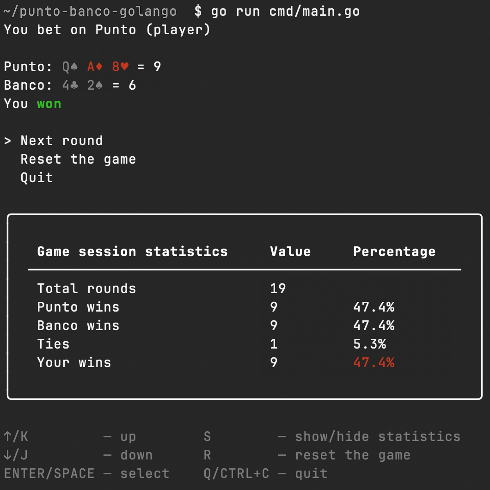

# Punto Banco (Baccarat) on Go

A Go implementation of the *punto banco* card game (a version of [Baccarat](https://en.wikipedia.org/wiki/Baccarat)), featuring a terminal-based UI built with the [Bubble Tea framework](https://github.com/charmbracelet/bubbletea/).

> This implementation does not include a gambling component — no real bets or payouts are involved.

## Running the Application

Execute the binary or run the application directly with:

```bash
go run cmd/main.go
```



## Features

- 6 decks in the shoe
- Casino-style shuffling with shoe cutting and card burning
- Game logic (`PlayPuntoBanco` function from `internal/punto_banco/punto_banco.go`) is separated from the UI, making it reusable for strategy simulations, but [the house always wins](https://paulvanderlaken.com/2018/01/10/baccarat-simulation-payoff/)

## Game Rules

*Punto banco* is a simplified version of Baccarat where each move is determined by the drawn cards. The game proceeds according to fixed rules, and players make no decisions during the coup (round). Unlike the *baccarat chemin de fer* that [James Bond played](https://www.youtube.com/watch?v=7nFgqmAMglk).

The game uses standard Baccarat card values:
- Ace = 1
- 2–9 = pip value
- 10 and face cards (Jack, Queen and King) = 0

The objective is to predict which of the two hands, the Punto (player) or the Banco (banker), will have a total closest to nine.

Player bets on either:
- Punto (player)
- Banco (banker)
- Egalité (tie)

The dealer deals two cards to both the player and the banker.

If the total of a hand is 10 or more, only the last digit is counted (modulo 10).

If either the player or the banker (or both) has a total of **8 or 9**, the round ends immediately, it is referred to as a «natural».

Otherwise:
- If the player's total is **0–5**, they draw a third card.
- If the player's total is **6 or 7**, they stand.

The banker's decision to draw a third card depends on both their total and the player's third card, following a predefined tableau:

**Banker's total / Player's third card value**

|         | 0 | 1 | 2 | 3 | 4 | 5 | 6 | 7 | 8 | 9 |
|---------|---|---|---|---|---|---|---|---|---|---|
| **0-2** | H | H | H | H | H | H | H | H | H | H |
| **3**   | H | H | H | H | H | H | H | H | S | H |
| **4**   | S | S | H | H | H | H | H | H | S | S |
| **5**   | S | S | S | S | H | H | H | H | S | S |
| **6**   | S | S | S | S | S | S | H | H | S | S |
| **7+**  | S | S | S | S | S | S | S | S | S | S |

Legend: H (Hit, draw another card), S (Stand, no more cards).

All possible combinations are covered with unit tests.
